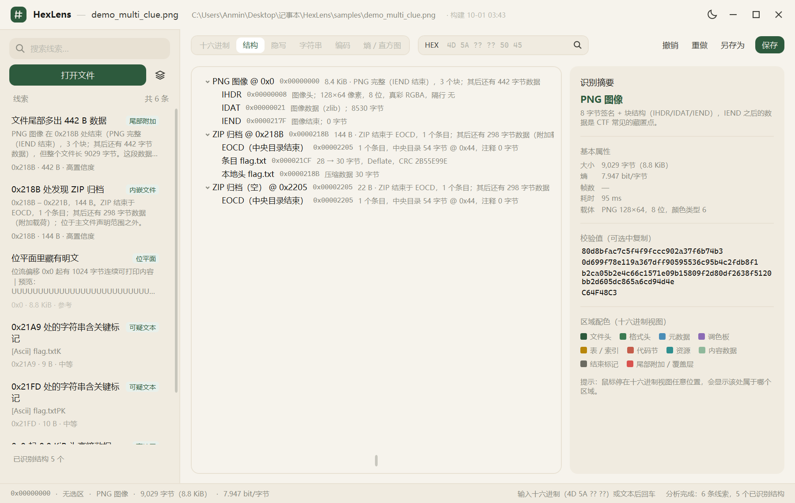
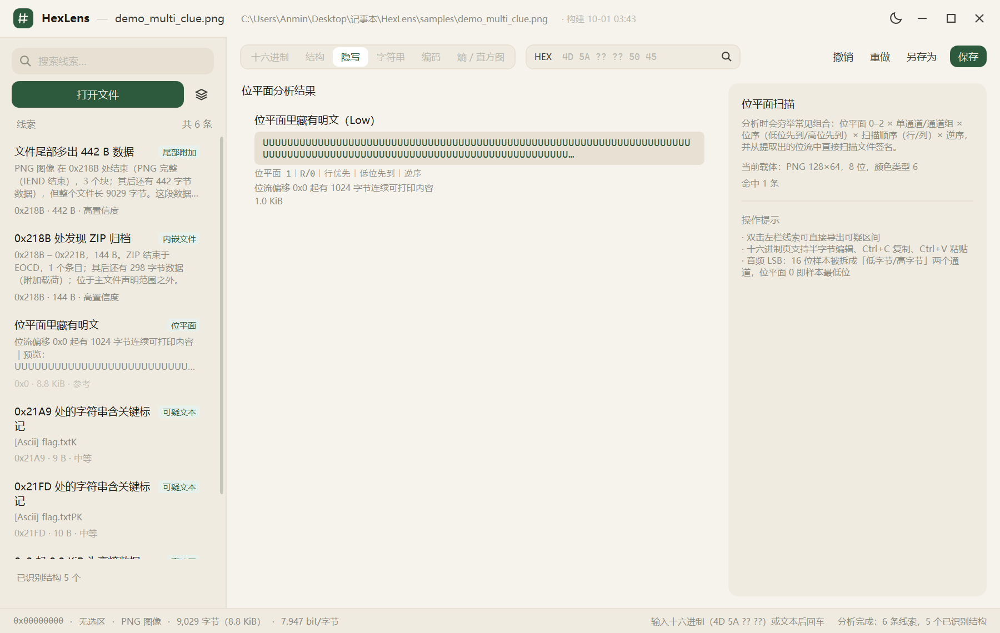
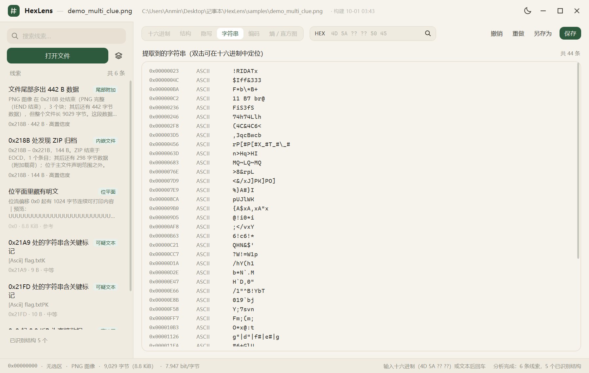
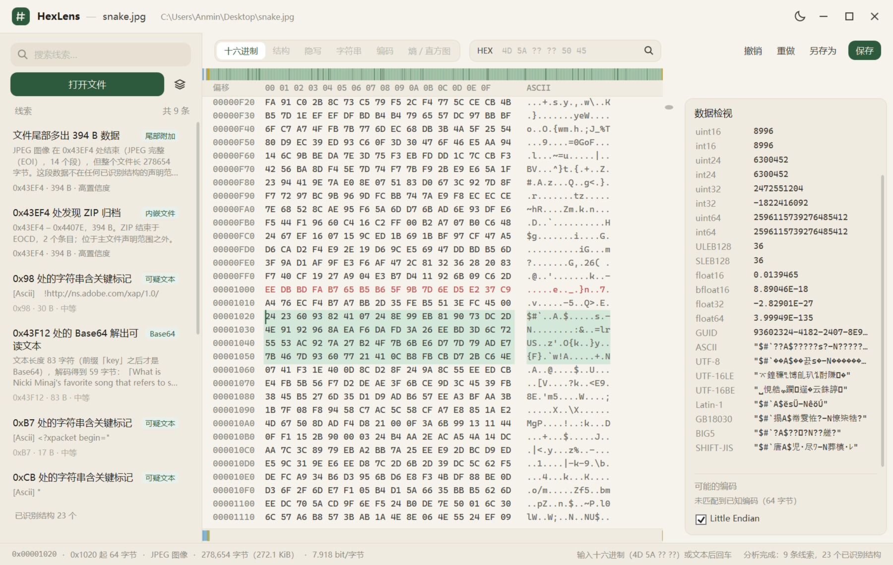

# HexLens

用 C# / WPF 写的十六进制编辑器，面向 CTF。

打开文件时会把可疑的地方列出来 —— 尾部多出来的数据、藏着的嵌入文件、位平面里的载荷、
编码线索、高熵区间。每条都带偏移、长度和判断理由，多数可以直接点开或导出。

## 界面

**结构**



**隐写**



**字符串**



**数据检视**



截图取自 `samples/demo_multi_clue.png` —— 一个同时含尾部附加 ZIP、位平面明文与可疑文本的样本。

## 能做什么

- **尾部附加**：主文件声明范围之外还有数据
- **内嵌文件**：PNG / ZIP / ELF / PDF 等完整文件被塞在别处
- **位平面**：穷举位平面与通道组合后，从位流里扫出文件签名或明文
- **Base64**：长串识别，带前缀也认
- **加密归档**：ZIP / RAR / 7z 含加密条目
- **高熵区间**：疑似压缩或加密数据的范围
- **类型不符**：扩展名与真实格式对不上，可一键改文件头
- **位反转**：反转后才能正常解析的数据
- **疑似加密字段**：指出"这段是密文，该去别处找密码"，不猜算法

也可以改字节：十六进制列做半字节覆盖，ASCII 列直接输入即可插入。
编辑期间源文件不动，保存时先写副本再替换，写不进去会退到 `%TEMP%`。

## 目录结构

```
HexLens/
├─ src/
│  ├─ HexLens.App/            主程序（WPF）
│  │  ├─ Controls/            自绘控件（十六进制视图、主题化对话框）
│  │  ├─ ViewModels/          视图模型
│  │  ├─ Themes/              配色与样式
│  │  ├─ Interop/             对原生库的 P/Invoke 封装
│  │  ├─ Diagnostics/         自检与冒烟测试
│  │  └─ Resources/           应用图标
│  └─ HexLens.Core/           分析核心（不依赖 UI）
│     ├─ Formats/             文件签名库、长度推导、结构化命中判定
│     ├─ Carving/             裁切与嵌套判定
│     ├─ Stego/               位平面提取与明文载荷识别
│     ├─ Clues/               线索引擎
│     ├─ Analysis/            编码、熵、XOR、CRC、密文识别、搜索
│     ├─ Documents/           字节文档模型与保存
│     └─ Util/                通用工具
├─ native/
│  └─ ctfcodec/               原生编码库（C++17，127 个算法）
├─ docs/                      设计文档与界面截图
├─ CMakeLists.txt             构建入口
└─ HexLens.slnx               解决方案
```

## 快速开始

需要 **.NET 10 SDK** 和 **CMake**，原生编码库随仓库一起构建，不用额外准备。

```powershell
cmake -S . -B build -G Ninja
cmake --build build
.\src\HexLens.App\bin\Debug\net10.0-windows\HexLens.App.exe
```

也可以把文件拖进窗口，或 `HexLens.App.exe <文件>`。

## 说明

- 仓库只跟踪主程序与说明文档。`tests/`、`scripts/`、`samples/` 是开发用的周边，不随仓库分发
  —— `CMakeLists.txt` 已做兼容，这些目录不存在时照常构建主程序
- 编码识别用的原生库源码在 `native/ctfcodec/`，由 CMake 一并编出 `ctfcodec.dll`
- 已知限制：JPEG / TIFF 不做像素级位平面；PNG 隔行图像只做结构分析；疑似加密字段不猜算法
- Windows 上路径若含中文，Ninja / MinGW 会构建失败（首次能过、增量必挂），
  建个 ASCII junction 再从那里构建即可

## 许可

GPL-3.0，全文见 [LICENSE](LICENSE)。

---

更细的实现说明与踩坑记录在 [docs/DETAILS.md](docs/DETAILS.md)，
各版本变更在 [docs/RELEASES.md](docs/RELEASES.md)。
