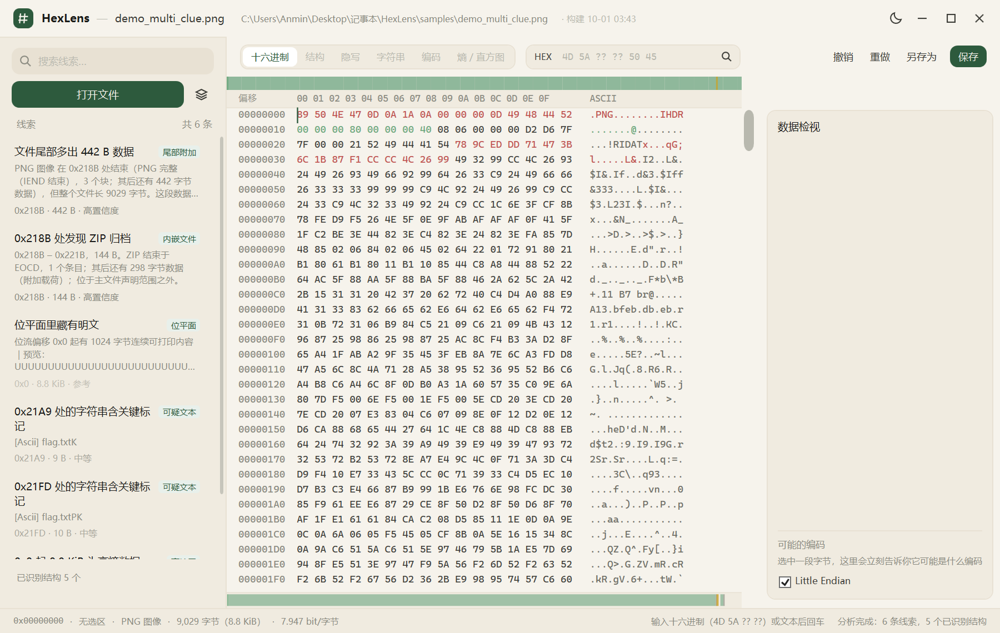
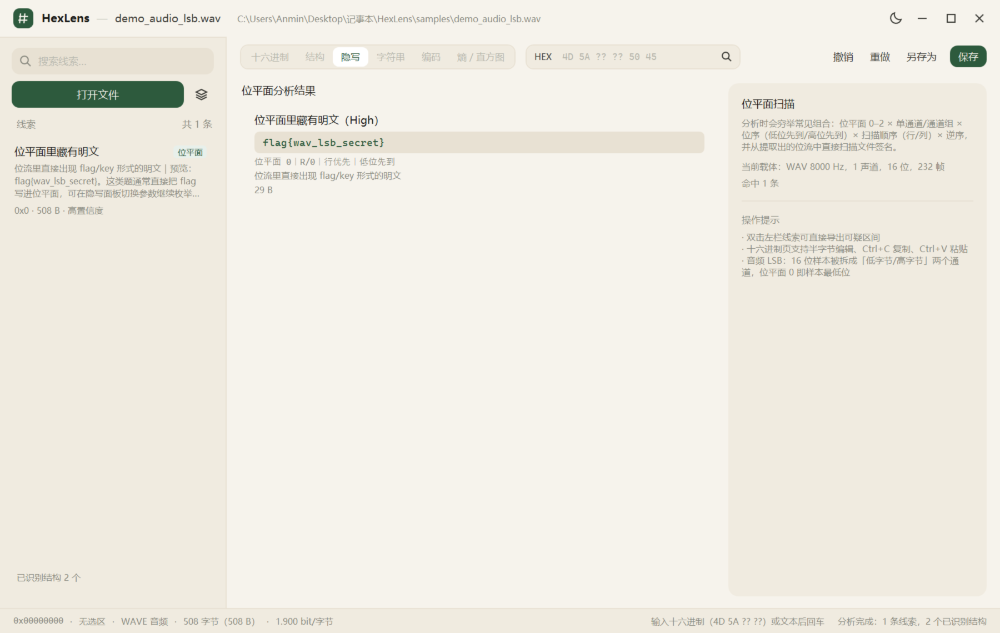
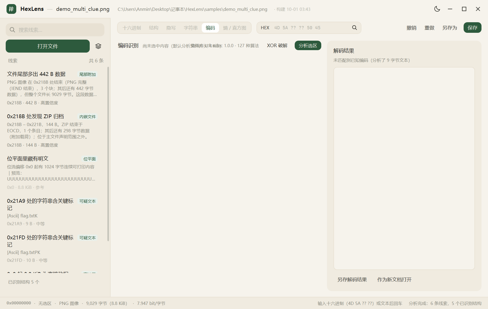
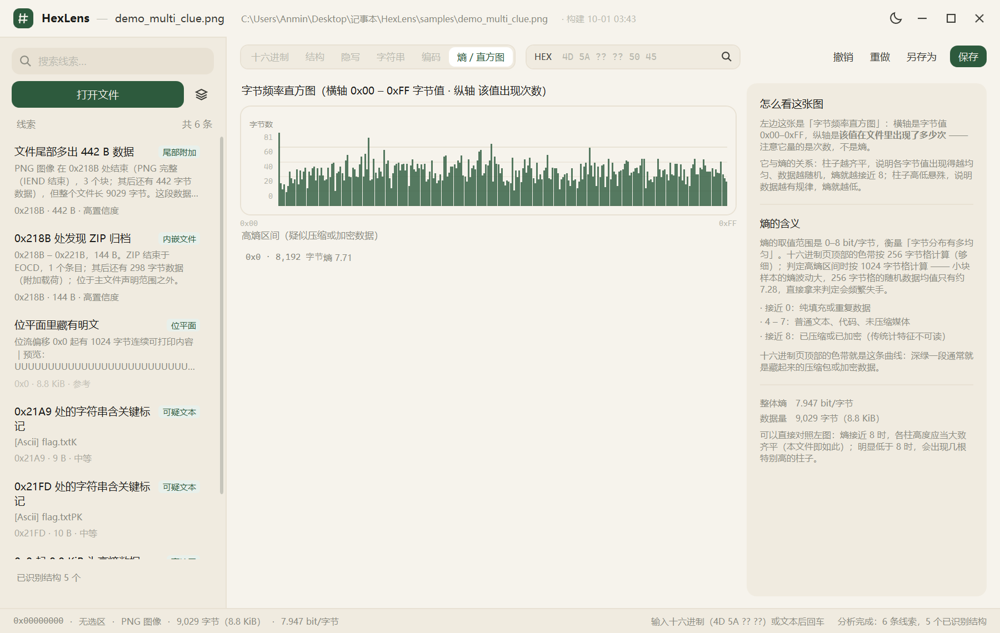

# 详细说明

一个用 **C# / WPF** 写的十六进制编辑器，重点不在"能改字节"，而在**打开文件的瞬间就把可疑之处指出来**：
图片尾部多了 442 字节？哪 442 字节？位平面里是不是藏了个 ZIP？这段高熵数据是压缩包还是加密块？

界面参考了 [floral-notepaper](https://github.com/) 的设计语言（纸白/墨色/竹绿、圆角卡片、克制的动效），
目标是在长时间盯字节的场景下不刺眼。

---

## 界面

| 十六进制（含熵色带与底部结构条） | 结构 |
|---|---|
|  |  |

| 隐写 | 字符串 |
|---|---|
|  |  |

| 位平面明文（直接显示还原内容） | 编码识别 |
|---|---|
|  |  |

| 熵 / 直方图 | 数据检视（对标 010 Editor 的 Data Inspector） |
|---|---|
|  |  |

> 截图取自 `samples/demo_multi_clue.png`（一个同时含尾部附加 ZIP、位平面明文与可疑文本的样本）。
> 全部版本的变更说明见 [`docs/RELEASES.md`](RELEASES.md)；
> 各类判定与阈值的原理见 [`docs/MATCHING.md`](MATCHING.md)。

---

---

## 它替你做了什么

打开一个文件后，左侧会直接给出**线索列表**（按可能性排序），每条都带偏移、长度、依据说明和可执行动作：

| 线索类型 | 说明 |
|---|---|
| 尾部附加 | 主文件声明范围之外还有数据 —— 最常见的"图种"藏法 |
| 内嵌文件 | 在某个偏移发现完整的 PNG/ZIP/ELF/PDF…… 并可一键导出 |
| 位平面 | 穷举位平面 × 通道 × 位序 × 扫描顺序后，从位流里直接扫出文件签名 |
| 位平面明文 | 位流里没有文件签名、但有明文（`flag{...}` 之类）—— CTF 里比藏整个文件更常见 |
| 疑似 Base64 | 长 Base64 串；解码后是文件或可读文本都会报出来，**带前缀也认**（`key` / `data:` 之后才是载荷的那种） |
| 加密归档 | ZIP/RAR/7z 含加密条目，提示已知明文攻击思路 |
| 高熵区间 | 疑似压缩或加密数据的范围（附全局熵色带） |
| 类型不符 | 扩展名与真实类型对不上 |
| 文件头不符 | 扩展名暗示是某格式、但开头字节不是它的签名 —— **可一键改回正确文件头** |
| CRC 不符 | PNG 各块的 CRC32 与内容对不上（手改宽高/像素就会这样，多数查看器会直接拒开）—— **可逐块一键重算** |
| 疑似反转 | 整份数据位反转/字节反转后就能正常解析 |
| 可疑文本 | flag / secret / password 之类的标记 |

主区六个视图：

- **十六进制**：虚拟化网格、**半字节编辑**（先高位后低位）与 **ASCII 列直接打字**（点哪一列就编哪一列）、选区、撤销重做；
  顶部**熵色带**（深绿一段通常就是藏起来的压缩包）；右侧滚动条加粗到 16px 且滑块为圆头，便于点中；
  **右侧「数据检视」面板**（对标 010 Editor）把选中字节按 uint/int/float/LEB128/GUID/多编码文本解释出来，
  并同时列出**可能的编码**；底部**结构条**按类别画成分段色带。
  标记采用**分层染色**：多数内容保持原色 → 结构性分区用浅色 → **需要注意的标红**
- **结构**：PNG 块链、ZIP 中央目录/条目、RIFF 子块、MP4 盒子、ELF/PE 头等，按文件分组展示，
  右侧附**区域配色图例**
- **隐写**：位平面扫描结果与命中参数（位平面/通道/位序/扫描顺序）；命中明文时直接显示还原出的内容
- **字符串**：ASCII 与 UTF-16 提取；**单击任意一行即复制**，右键可复制全部；双击定位到十六进制
- **编码**：对选中区间跑编码识别（见下节），一键解码并预览，解码结果是文件时可另存或作为新文档打开；
  **在十六进制里框选即自动识别**，结论直接显示在视图下方，不必切页；
  另有 **XOR 暴力破解**：对选区遍历 256 个单字节密钥，按"结构性证据"（可打印占比 / 开头是否撞文件签名 / 是否含 `flag{...}`）排序给出候选，一键把密钥应用到该区间
- **熵 / 直方图**：字节频率分布 + 高熵区间列表

**怎么确认自己跑的是哪一版**：窗口顶栏会显示「· 构建 MM-dd HH:mm」——重新发布后这里会变。
若你说的现象和我改的不一致，先看这行字，多半是还在跑旧的 exe。

常用快捷键：`Ctrl+O` 打开 · `Ctrl+S` 保存 · `Ctrl+Z/Y` 撤销重做 · `Ctrl+F` 搜索 · `F5` 重新分析 · 直接拖文件进窗口

复制与跳转：`Ctrl+C` **智能复制**（选区像文本就给文本，否则给十六进制）· `Ctrl+Shift+C` 强制复制十六进制 ·
十六进制区**右键菜单**（复制文本 / 十六进制 / C 数组 / Python bytes）· 单击左栏线索**居中跳转**

---

---

## 快速开始

```powershell
# 1) 配置（只需一次）
cmake -S C:\HexLens -B C:\HexLens\build -G Ninja

# 2) 构建：原生编码库 → Core → App → Tests → 自动跑测试
cmake --build C:\HexLens\build

# 只重新构建 C# 应用层
cmake --build C:\HexLens\build --target hexlens-app

# 3) 直接跑（可带文件参数）
.\src\HexLens.App\bin\Debug\net10.0-windows\HexLens.App.exe 某个可疑文件.png
```

> ⚠️ **上面的路径是 `C:\HexLens`，不是项目真实位置** —— 这不是笔误，是必须的。
> CMake 里的 GNU 工具链（Ninja / MinGW Make）在 Windows 上**处理不了含中文的路径**，
> 而且表现很阴：**首次构建能过、增量构建必挂**。所以项目路径若含中文
> （例如 `桌面\记事本\HexLens`），先建一个 ASCII 路径的 junction：
>
> ```powershell
> New-Item -ItemType Junction -Path C:\HexLens -Target "<本项目真实路径>"
> ```
>
> junction 对普通用户可用、完全透明，**产物仍然落在真实目录里**，不需要移动任何文件。

生成一批"藏了东西"的演示样本（都是 CTF 里真实会遇到的藏匿方式）：

```powershell
.\tests\HexLens.Tests\bin\Debug\net10.0\HexLens.Tests.exe make-samples samples
```

三层自检，都不需要人盯着看：

```powershell
# ① 界面链路：键入十六进制 → 撤销 → 删除 → 另存回读 → 布局度量
.\src\HexLens.App\bin\Debug\net10.0-windows\HexLens.App.exe --smoke-test=report.txt

# ② 编码库自检（不创建窗口，几秒出结果）
.\src\HexLens.App\bin\Debug\net10.0-windows\HexLens.App.exe --codec-test=codec-report.txt

# ③ 端到端运行测试：9 个场景逐个真实启动，检查进程存活 / 窗口 / 标准错误 / 抓图留证
.\scripts\run-test.ps1
```

---

---

## 编码识别

选中一段字节 → 切到「编码」页 → 自动跑启发式识别。它回答的是"这串东西是什么编码、解出来是什么"：

| 能力 | 说明 |
|---|---|
| 识别 | 127 种算法 × 7 大类（Base / Text / Unicode / Classic / Cipher / Hash / Binary），给出**置信度 + 判断依据 + 预览** |
| 解码 | 点「用这个解码」按该算法还原，右侧同时显示可读文本与十六进制预览（都可选中复制） |
| 落地 | 解码结果若是已知文件（PNG/ZIP/PE…）会直接报出类型，可**另存**或**作为新文档打开**继续分析 |
| 降级 | 原生库缺失或位数不符时只提示"编码库不可用"，其余分析功能不受影响 |

识别给的是**打分 + 依据**而不是"猜一个"：

```
SGVsbG8sIEhleExlbnMh  →  base64  88%  —— Base64 字符集且长度为 4 的倍数，解码后可读文本
48656c6c6f2c204865784c656e7321  →  base16  78%  —— 仅由十六进制字符组成，长度为偶数，字节可读
```

典型用法：文件里有一段可疑的 Base64/十六进制，在十六进制视图里框选它，编码页就能看到结论。

**带前缀的 Base64 也认**：实战里很少"从第一个字符就干净开头"，常见形态是 `keyV2hhdCByc…`、
`data:image/png;base64,…`。含前缀时整串长度不是 4 的倍数，直接解码必然失败 ——
所以探测会**试 0–3 四种起始偏移**，取可读性最好的那个（随机字节约 37 分，判定阈值 55 分）。
这条逻辑提炼成 `Base64Probe`，由线索引擎与界面**共用同一套判定**，
避免出现"左栏说是 Base64、选中识别却说没匹配到"的自相矛盾。

---

---

## 交互细节

| 操作 | 行为 |
|---|---|
| **打开 / 拖入文件** | 先弹主题化对话框问「**编辑**」还是「**只读**」—— 取证只看不动时选只读，此后任何修改（含撤销重做）都会被拒绝并说明原因。命令行启动、拖放批处理等自动化场景不问，直接按编辑打开 |
| **框选一段字节** | 右侧「数据检视」立刻给出 uint8…uint64 / int / float16…float64 / ULEB128·SLEB128 / GUID，以及 ASCII·UTF-8·UTF-16(LE/BE)·Latin-1·GB18030·BIG5·SHIFT-JIS 的解释；同时自动识别**可能是什么编码**并给出解码预览（不用切页、不用点按钮；识别部分选区 > 8 KiB 时只提示不做） |
| **勾选 Little Endian** | 切换字节序，多字节数值按另一种顺序重新解释 |
| **单击左栏线索** | 切到十六进制视图，把对应区间**滚到可见区中央**并高亮 |
| **`Ctrl+C`** | 智能复制：选区可打印比例 ≥ 90% 就复制**文本**，否则复制**十六进制** |
| **`Ctrl+Shift+C`** | 强制复制十六进制 |
| **十六进制区右键** | 复制文本 / 复制十六进制 / 复制为 C 数组 / 复制为 Python bytes / 全选 |
| **字符串页单击一行** | 直接复制该字符串（状态栏提示），右键可复制全部 |
| **弹窗** | 一律用主题化弹窗（纸感圆角、明暗跟随），不是系统那个灰白方框；超过 40 字符的内容带「复制」按钮，Esc 关闭 / 回车确定 |
| **确认版本** | 顶栏显示「· 构建 MM-dd HH:mm」，一眼看出跑的是哪一版，排查「改了怎么没生效」时最省事 |
| **在 ASCII 列直接打字** | 敲可打印 ASCII 会**插入**一个字节（后面的内容整体后移，不是覆盖）；**只接受 ASCII**（汉字 / emoji / 控制字符一律拒绝，且切到该列时自动关闭输入法，防止拼音字母混入文件）；`Backspace`/`Delete` 删除字节。点 ASCII 列切过去，点十六进制列切回**覆盖式**半字节编辑 |

---

---

## 识别是怎么做的

```
字节流
 ├─① 签名扫描      约 110 种文件头，单遍桶扫描（含掩码匹配，如 RIFF 家族）
 ├─② 长度推导      每个命中按格式算出边界：PNG→IEND、ZIP→EOCD、GZIP→deflate 末尾、
 │                7z→下一段头偏移、TAR→双零块、JPEG→EOI、RIFF/BMP→size 字段……
 ├─③ 嵌套判定      被别的文件区间包住 = 容器内部内容；在外面 = 可疑藏匿
 ├─④ 载体解码      PNG/BMP/GIF/WAV 自己解码出真实像素与采样（零外部依赖）
 ├─⑤ 位平面穷举    位平面 0–2 × 单通道/通道组 × 位序 × 行/列序 × 逆序
 │                每次先小窗探测，命中才全量提取，再从位流里扫签名
 ├─⑥ 结构化命中判定 命中必须靠近开头 **且** 长度可被结构推导 —— 否则视为巧合
 ├─⑦ 明文载荷判定   位流里没有文件签名时，找「最长连续可打印段」（≥20 字节）+ `flag{...}` 正则；
 │                 载荷后面跟着的 0 填充不影响判定
 ├─⑧ 完整性校验     PNG 各块 CRC32 重算比对、扩展名反查签名库，给出可写回的修正值
 └─⑨ 线索引擎      把以上事实翻译成带动作的结论（含一键修复：改文件头 / 重算 CRC / 应用 XOR 密钥）
```

第 ⑥ 步是准确率的关键。只按魔数判断的话，光是 ICO 的 `00 00 01 00` 就能在一份样本上刷出十条噪声
（实测：加这条判据前 12 条命中、真命中 1 条；加之后 1 条命中、正是真载荷）。

> 📖 **每个阈值的来龙去脉**（签名掩码、长度推导、防误报判据、熵与打分的取值理由、
> 以及踩过的坑）单独整理在 [`docs/MATCHING.md`](MATCHING.md)。

---

---

## 项目结构

```
HexLens/
├─ src/HexLens.Core/            纯 .NET 分析引擎（无 UI 依赖，可单测）
│  ├─ Documents/                ByteDocument：编辑 + 撤销重做
│  ├─ Formats/                  签名库、长度推导、结构解析、结构化命中判定、结构区域展平与分类
│  ├─ Carving/                  签名定位 + 藏匿判定
│  ├─ Stego/                    PNG/BMP/GIF 解码、WAV 读取、位平面提取、明文载荷判定
│  ├─ Analysis/                 熵、直方图、字符串、哈希、搜索、数据检视、PNG CRC 校验、XOR 暴力破解、总装入口
│  ├─ Clues/                    线索引擎
│  └─ Util/                     位流、字节序、CRC32（PNG 块校验用）
├─ src/HexLens.App/             WPF 界面
│  ├─ Themes/                   设计令牌（亮/暗）+ 控件样式 + 主题管理
│  ├─ Interop/CtfCodec          P/Invoke 内置原生库的 127 个编码算法
│  ├─ Controls/HexEditorView   自绘虚拟化十六进制视图（熵色带 + 结构条 + 关键位置染色）
│  ├─ Controls/ThemedDialog     主题化弹窗（提示 / 二选一询问），替代系统 MessageBox
│  ├─ ViewModels/               视图模型（含异步分析调度）
│  ├─ lib/ctfcodec.dll          原生编码库**构建产物**（不入库，由 CMake 从源码编出后平铺到输出根目录）
│  └─ Diagnostics/              界面链路自检 + 编码库自检
├─ native/ctfcodec/             原生编码库源码（C++17，本项目内置，含 CMakeLists 与自带测试）
├─ tests/HexLens.Tests/         自建断言框架 + 样本工厂 + 42 项用例
└─ scripts/                     build / publish / 截图 / 端到端运行测试
```

---

---

## 验证记录

不写"应该能跑"，只写实际跑过的：

| 项目 | 结果 |
|---|---|
| 核心测试 | **42 / 42 通过**（含 PNG 五种行滤波往返、GIF LZW 往返、GZIP 精确到 deflate 末尾、PNG/BMP/WAV 解码比对、位平面注入→识别闭环、位流明文识别 + 噪声不误判、**带前缀 Base64 识别 + 随机数据不误判**、保存落盘回读、**XOR 暴力破解能挑出正确密钥**、**随机数据不会被硬凑出高置信候选**） |
| 界面自检 | **40 / 40 通过**（真实编辑链路 + 智能复制**真读剪贴板比对** + 右键菜单已构建且套用主题 + 居中跳转 + 选中即识别 + ASCII 列编辑与只收 ASCII + **主题化弹窗的类型/实例化/主题令牌解析**） |
| 编码自检 | **11 / 11 通过**（原生库加载、127 种算法清单、base64/hex/url 识别、编解码往返、未知算法不崩溃、端到端 base64 文本 → 1821 字节 PNG） |
| 端到端运行 | **9 / 9 场景**（空启动 + 6 类输入 × 6 个视图，逐个真实启动并检查进程存活 / 窗口标题 / 标准错误 / 抓图） |
| 构建告警 | 0 警告 0 错误 |
| 实测样本 | 图片尾部附加 ZIP、LSB 藏 ZIP、**WAV 低位藏 flag 明文**、综合样本（ZIP+Base64）、干净样本（不误报） |

核心测试里的编码器（PNG/GIF/WAV/BMP/TAR）是**为测试独立实现**的写入端，
用来做往返比对 —— 拿自己的输出喂自己证明不了正确性。

---

---

## 发布与分发

```powershell
.\scripts\make-release.ps1     # 一次出两个版本 + 启动验收 + 打包 zip
```

| 版本 | 目录 | 体积 | zip | 目标机要求 |
|---|---|---|---|---|
| 小版 lite | `dist\HexLens-lite` | 1.6 MB | 0.65 MB | 需装 .NET 10 桌面运行时 |
| 大版 full | `dist\HexLens-full` | 141 MB | 62.7 MB | **零依赖**，双击即跑 |

两个版本都会做**真实的启动验收**（跑界面自检 40 项），并各自附一份《使用说明.txt》说明是否需要装运行时。
大版默认删掉 `cs/de/es/fr/it/ja/ko/pl/pt-BR/ru/tr` 语言资源目录（省约 7 MB；缺资源时 .NET 回退英文，不影响功能）。

需要其它形式时用 `publish.ps1`：`-Mode fd` / `-Mode standalone` / `-Mode single`（单文件需另下 ILLink）。

**自包含版（standalone）实测结果**：

| 检查 | 结果 |
|---|---|
| 运行时随行 | 产物含 `coreclr.dll`、`System.Private.CoreLib.dll`、`PresentationFramework.dll`、`PresentationCore.dll` |
| 免安装验证 | 屏蔽系统运行时后（`DOTNET_ROOT` 指向不存在的路径 + `DOTNET_MULTILEVEL_LOOKUP=0`）**仍能启动**，自检 24/24 通过 |

即：`publish\HexLens-standalone\` 整个目录拷到任何 Windows x64 机器（无需安装 .NET），双击即可运行。

**离线环境如何做出自包含版**：self-contained 需要 NuGet 上的 runtime pack。把手工下载的 `.nupkg`
**原样**（不要解压）放进 `local-packages\` 目录即可 —— `NuGet.config` 已把它配成本地源；
`publish.ps1` 在缺包时会直接打印**包名 + 版本 + 可下载直链**，不必自己猜。

---

---

## 版本与仓库

- 分支 `main`，版本标签 `v1.0.0` / `v1.1.0` / `v1.2.0` / `v1.3.0` / `v1.4.0`
- `.gitignore` 排除：构建产物（`bin/`、`obj/`、`.vs/`）、离线包缓存（`.nuget/`、`.dotnet/`、`local-packages/`）、
  发布产物（`dist/`、`publish/`）、过程截图与报告（`artifacts/`）
- **发行物不入库**：`dist/` 下的两个版本与 zip 可用 `scripts\make-release.ps1` 一条命令重建
- `.gitattributes` 把 `samples/**`、图片与压缩包标记为二进制，避免换行转换破坏刻意构造的坑题样本

---
---

## 已知限制（先说清楚）

- **JPEG/TIFF 不做像素级位平面分析**：没有自带 JPEG 解码器；而且有损压缩本身会毁掉 LSB。它们的价值在尾部附加数据、EXIF 与段结构，这些是支持的。
- **PNG Adam7 隔行图像**只做结构分析，不进入像素级。会明确报"暂不支持"，不会静默给错结果。
- **GIF 逐帧只分析第一帧**（帧数、每帧布局都能列出）。
- **音频只做 PCM 样本低位与容器结构**，没有做频谱图/FFT（SSTV 那类题目需要另配工具）。
- **加密归档只识别与提示**，不内置破解（ZipCrypto 已知明文攻击建议外部用 bkcrack）。
- **文档内存驻留**：单文件上限 1 GiB；更大的文件需要改成分块/映射读。
- 十六进制编辑走"整字节 + 半字节"输入，没有实现任意长度的插入模式块粘贴 UI（`Ctrl+V` 已支持十六进制与文本）。
- **编码识别依赖原生库**：`ctfcodec.dll`（x64）随程序一起分发。缺失或位数不匹配时，编码页会明确提示"编码库不可用"，
  其余分析功能不受影响（不会崩、也不会静默给错结果）。
- **保存采用 Office 式「副本优先」**：打开文件时在同目录生成隐藏工作副本（`.名字.hexlens-work`）并**从副本读取**，
  编辑期间原文件内容不变、也不被占用；编辑停下 2 秒会把内容刷进副本作为**自动恢复点**；
  保存时原子写回原文件（临时文件 → 替换 → 旧版留成隐藏备份 `.名字.hexlens-bak`）。
  **若上次异常退出，下次打开会因「副本比原文件新」而自动恢复未保存的修改。**
- **ASCII 列是插入模式**：打字会在光标处插入字节，文件长度随之变化；十六进制列则是覆盖式半字节编辑。
- **ASCII 列编辑只接受可打印 ASCII（0x20–0x7E）**：汉字、emoji、控制字符一律拒绝；切到该列时还会
  **自动禁用输入法** —— 否则中文输入法的拼音（它们本身就是 ASCII）会被敲进文件，形成极难排查的污染。
  需要写非 ASCII 字节时请用十六进制列。
- **明文载荷识别有边界**：要求位流里存在 ≥20 字节的连续可打印内容。若题目把明文先异或/压缩再写进位平面，
  本工具不会去猜密钥 —— 需要你先在别处解出来，再把结果丢进来判断。

---

---

## 环境注意（本机踩过的坑）

1. **不要用 `dotnet build HexLens.slnx`**：本机 .NET SDK 缺 `Microsoft.NET.SDK.WorkloadAutoImportPropsLocator`
   目录，解决方案级 restore 会以 `MSB4276` 失败（项目级构建不受影响）。请用顶层 CMake（它会逐个项目调用 `dotnet build`），
   它逐个项目构建。
2. **离线可构建**：仓库里带了 `NuGet.config` 并清空了包源 —— 本项目零 NuGet 依赖，只用到 SDK 自带的 WPF 与 BCL；
   清空源可避免离线环境 restore 卡在访问 nuget.org。
3. **主题字体**：默认用系统字体（Microsoft YaHei UI / Cascadia Mono）。参考项目用的是 HarmonyOS Sans SC，
   想换的话把字体文件放进 `src/HexLens.App/Assets/` 并在 `Themes/Styles.xaml` 里改 `UiFont`。
4. **双屏不同缩放**：窗口跨屏时 DPI 变化会触发重算字符宽度与行高（`OnDpiChanged`），否则光标与选区会错位。
5. **编码库从源码构建**：源码在 `native\ctfcodec\`，顶层 CMake 编出 `ctfcodec.dll` 并放到
   `src\HexLens.App\lib\`，csproj 再用 `Link="ctfcodec.dll"` 把它平铺到 exe 同目录 ——
   `DllImport` 只在 exe 同目录找库，放进 `lib\` 子目录会加载失败（这个坑踩过）。
   两个细节：① 原生库**固定用 Release 构建**（Debug 版带完整符号，实测 6540 KB vs 995 KB）；
   ② CMake 里设了 `PREFIX ""`，否则 MinGW 产出 `libctfcodec.dll`，与 `DllImport` 要找的名字对不上。
   没有 C++ 编译器时构建**不会中断**：只会跳过原生库，此时「编码识别」显示为不可用，其余分析能力不受影响（仓库里没有预编译 DLL 兜底，`ctfcodec.dll` 一律从源码构建）。
6. **依赖系统编码库时的排查**：编码功能异常先跑 `--codec-test=报告.txt`，它会明确报出"库是否加载、算法几条、哪一步失败"。

---

---

## 仓库范围说明

> ⚠️ **本仓库跟踪主程序与其说明文档**：`src/`（主程序与核心库）、`native/`（其运行依赖）、
> `docs/`（设计文档与界面截图）、以及构建入口。
>
> `tests/`、`samples/`、`scripts/` 属于**开发与验证用的周边，不随仓库分发** ——
> 所以下文里指向它们的命令（`tests\HexLens.Tests\...`、`scripts\*.ps1`）
> **在 git clone 出来的副本上会失效**（但这不影响构建与运行主程序）。
>
> `CMakeLists.txt` 已做兼容：这些目录不存在时，照样能配置并构建出主程序
> （构建时会打印「tests/ 已存在: ON/OFF」，便于确认当前状态）。

---

## 许可与出处

**本项目采用 [GNU General Public License v3.0](../LICENSE)（GPL-3.0）授权。**

简言之：可自由使用、修改、分发，但**衍生作品必须同样以 GPL-3.0 开源**，并保留版权声明。

- 设计语言参考 floral-notepaper（纸白/墨色/竹绿配色与卡片式列表），实现为本项目独立完成。
- 未引入任何第三方 NuGet 包；PNG/BMP/GIF/WAV 解码、LZW、CRC32、长度推导全部为自实现。
- **编码识别**来自本项目内置的 `native/ctfcodec`（C++17 / 纯 C ABI，127 个算法、7 大类）。
  源码完整放在本仓库，HexLens 通过 P/Invoke 调用由它构建出的 `ctfcodec.dll`，
  因此 clone 下来自己编一次即可 —— 不依赖任何外部项目，也不依赖预编译二进制。
  集成方式与其中一处 CMake 设置（去掉共享库 `lib` 前缀，否则 MinGW 产物名对不上 `DllImport`）
  记在 [`native/ctfcodec/README-HEXLENS.md`](../native/ctfcodec/README-HEXLENS.md)。
  （顺带记录：`ctf_algo_list_json()` 导出的 JSON 在 help 文本含 `\X` 时未转义，
  任何严格解析器都会拒绝整份清单；本项目因此改用逐项 API `ctf_algo_count/name/category/help/...` 读取。）
